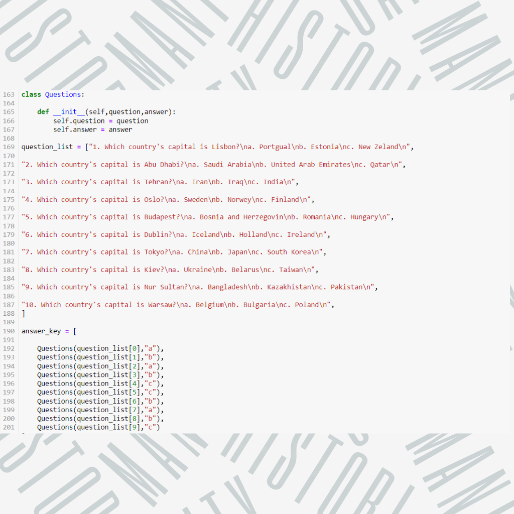
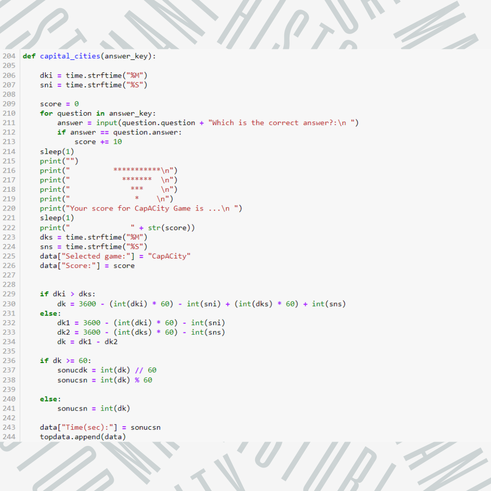
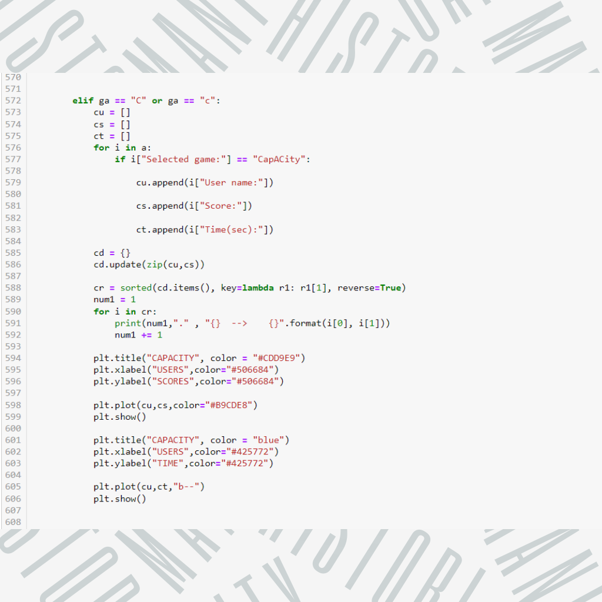

---

# How to play the game?
### First of all, a main menu greets the player. Name information is received and saved. Then the user is asked to choose one of the 3 games and the timer starts. When the user finishes the game, the timer stops and records the time. How many points the player has scored is shown at the end of each test. If the player wants to continue the game, he/she chooses one of the remaining two games and the same operations continue here. When the games are over, the user is asked if he/she wants a more detailed analysis. It compares their stats with players who have played or quit the game before.
---
### Requirements:

```
Python 3.6+
pip install -r requirements.txt
```

--- 

# My algorithm in questions and answers.

### I created two separate classes for questions and answers. I predetermined the correct answer for each question.



---

# My algorithm in scores and time.
### I recorded the time when the game started and the time when it ended. By taking the difference between these two, I found the completion time of the game. By comparing the correct answers and the answers given by the user, I added 10 points to the score for each correct answer. I recorded all of these data in the dictionary containing the user's name.


---
# My algorithm in graphics.
### I took the data related to the game that the user wanted to analyze from the dictionary containing the data of the user and transferred them to the dictionary containing the data of other users. I presented a visual analysis to the user by comparing points and time.


---
# What did I do?

- I did 3 quizzes.
- I Stored user information.
- I calculated how long it takesthe user to solve.
- I acted according to user request by making main menu.
- I presented the user's analysis visually.


# Thank You!
---
